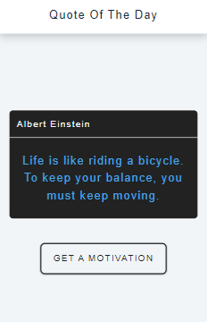

<h1 align="center"> Quote Of The Day </h1>

<p align="center">Front-End project of a motivational quote generator.</p>

<p align="center">
 <a href="#about">About</a> •
 <a href="#technologies">Technologies</a> • 
 <a href="#howToUse">How to use</a> 
</p>

<h2 id="about"> About </h2>
<p> Quote Of The Day is an website that generates motivational quotes. The 'Get A Motivation' button when clicked will generate a new one motivational phrase randomly. The text color also changes randomly when the button is clicked.
Page content is responsive to mobile and desktop screens. </p>

<div align="center">



</div>

---

<h2 id="technologies"> Technologies </h2>
<ul>
    <li> JavaScript / DOM </li> 
    <li> HTML </li>
    <li> CSS </li> 
</ul>

---

<h2 id="howToUse"> How to use </h2>
<p> 
Running this application locally:
</p>

```bash
# Clone this repository 
$ git clone https://github.com/tamyrisoliveira/quote-of-the-day.git
```
<p> 
Open the project folder and then open the index.html file in your browser.
</p>

---
Made with 💜 by Tamyris Oliveira

  